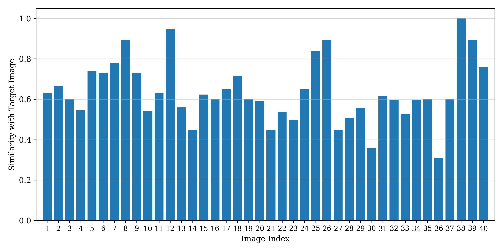

# ICE2607 Lab4: Locality Sensitive Hashing (LSH)

This project uses **LSH** for retrieving target images from a dataset. It offers a user-friendly command-line interface for image search, allowing comparison of search speeds with the **NN** algorithm. Additionally, it enables easy plotting of image similarities and utilizes **ResNet** for enhanced image feature extraction.

## File Structure

- `src/`
    - `knn.py`: Includes the KNN class.
    - `lsh.py`: Includes the LSH class.
    - `main.py`: Main Python script.
    - `plot.py`: Visualization functions.
    - `preprocess.py`: Image preprocessing utilities.
- `dataset/`: Default dataset images.
- `results/`: Search results and report figures.
- `target.jpg`: Default target image.
- `Lab4_report.pdf`
- `README.md`
- `Makefile`
- `requirements.txt`

## Install

1. Ensure that you have Python installed on your system.

2. Clone or download this project and navigate to the project directory.

3. Check if the dependencies listed in `requirements.txt` are installed. If not, create a virtual environment (if necessary) and run `make install`.

## Usage

### Default LSH retrieval

```
python -m src.main \
    --image-dir path/to/image/dataset \
    --target-dir path/to/target/image
```

Note:
- Avoid duplicate filenames in `image-dir`.
- If the parameters are not specified, the program will utilize **target.jpg** as the target image, 40 images in the **./dataset** directory.

### Retrieval Speed Comparison

```
python -m src.main \
    --image-dir path/to/image/dataset \
    --target-dir path/to/target/image \
    --type comp
```

### Personalized Projection Set

```
python -m src.main \
    --image-dir path/to/image/dataset \
    --target-dir path/to/target/image \
    --indicator 1 12 24
```

Note:
- All numbers in the projection set should fall within [1, 24].

### ResNet Feature Extraction

```
python -m src.main \
    --image-dir path/to/image/dataset \
    --target-dir path/to/target/image \
    --resnet True
```

### Additional: Similarity Plotting

- For common features:

```
python -m src.plot similarity
```



- For ResNet features:

```
python -m src.plot similarity_resnet
```


### Additional: Retrieval Time Exploration

```
python -m src.plot time_comp
```


```
python -m src.plot time_init_search
```

